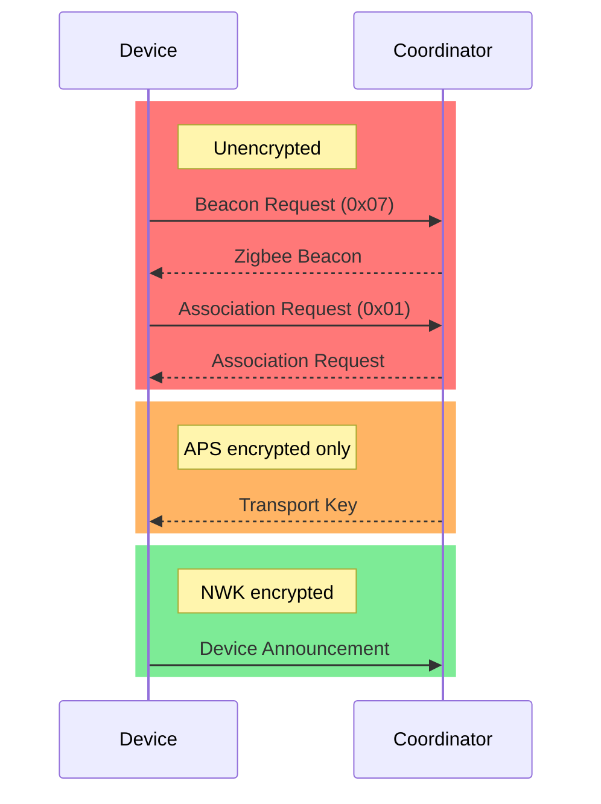

# Zigbee Stack

A `no_std` ZigBee Protocol Stack implementation based on the [ZigBee specification 23](https://csa-iot.org/wp-content/uploads/2024/07/docs-05-3474-23-csg-zigbee-specificationR23.1.pdf)

The core network layer and security features. Deals with addressing, keys, trust center, formation and discovery mechanisms.

---

## 🏛️ License

Licensed under either of:

- Apache License, Version 2.0 ([LICENSE-APACHE](LICENSE-APACHE) or http://www.apache.org/licenses/LICENSE-2.0)
- MIT license ([LICENSE-MIT](LICENSE-MIT) or http://opensource.org/licenses/MIT)

## 🧩 Contribution

This is a free and open project and lives from contributions of the community.

See our [Contribution Guide](CONTRIBUTING.md)

